# Features

## Global Features

- **Navigation Bar:** A responsive navigation bar with links to the home page, profile, messages, favorites, and login, depending on user authentication status. It also includes a search box.
- **Footer:** Includes links to privacy policies, terms and conditions, and social media connections. Also features category-based navigation with dynamic filtering for quick access to categories.
- **Cookie Consent Banner:** A cookie consent banner that allows users to accept or decline cookies, with preferences saved in local storage.

## Home Page

- **Hero Section:** A visually appealing banner with a call to action for users to find local deals.
- **Search Functionality:** A search box that allows users to search for listings across the platform, with mobile-friendly modal integration for search.
- **Filtering Options:** Quick access to popular categories and filtering options for price, location, and condition.

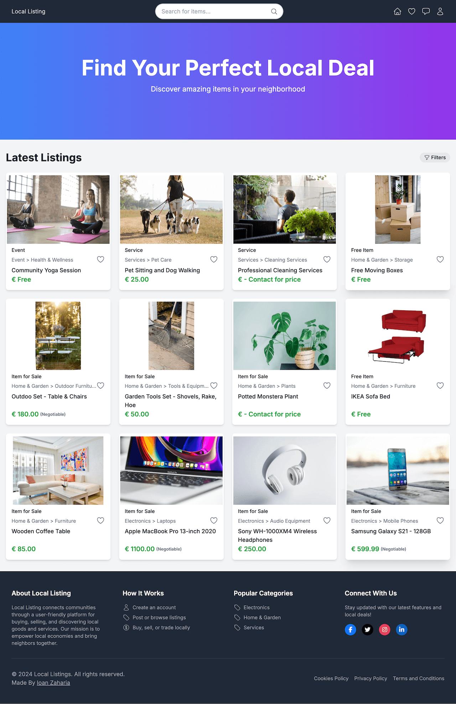

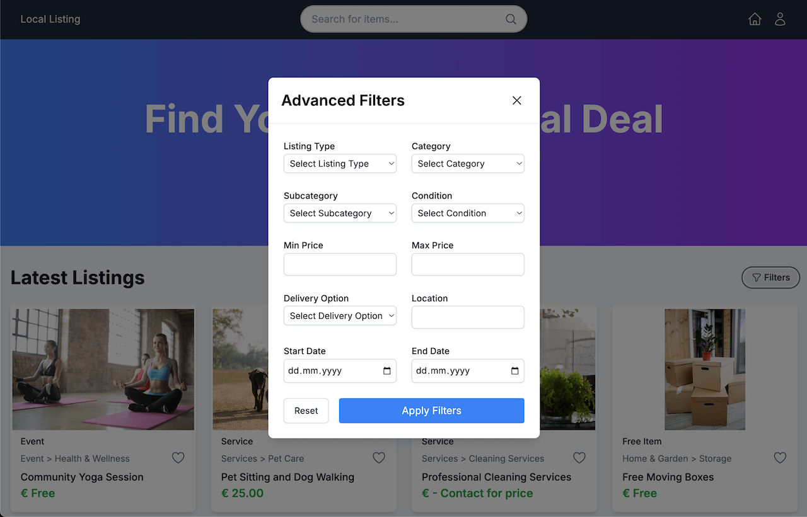

## Listings

- **Listing Creation:** A form allowing authenticated users to create new listings by adding details such as title, description, category, price, condition, and images.
- **Edit Listings:** Authenticated users can edit their listings using a dedicated form.
- **Delete Listings:** Users can delete their listings.
- **Listing Detail View:** Provides detailed information about individual listings, including images, description, price, and contact details.
- **Related Listings:** Shows similar listings on the detail page to encourage further exploration.
- **Favorite Listings:** Allows users to mark listings as favorites and access them from their profile.

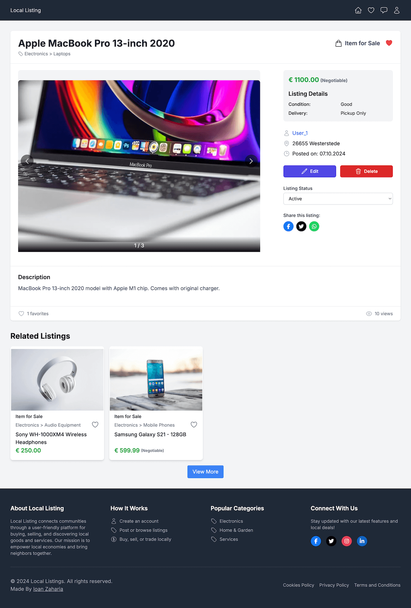

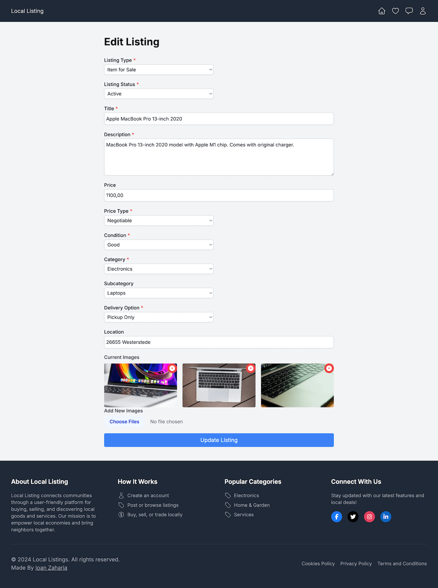

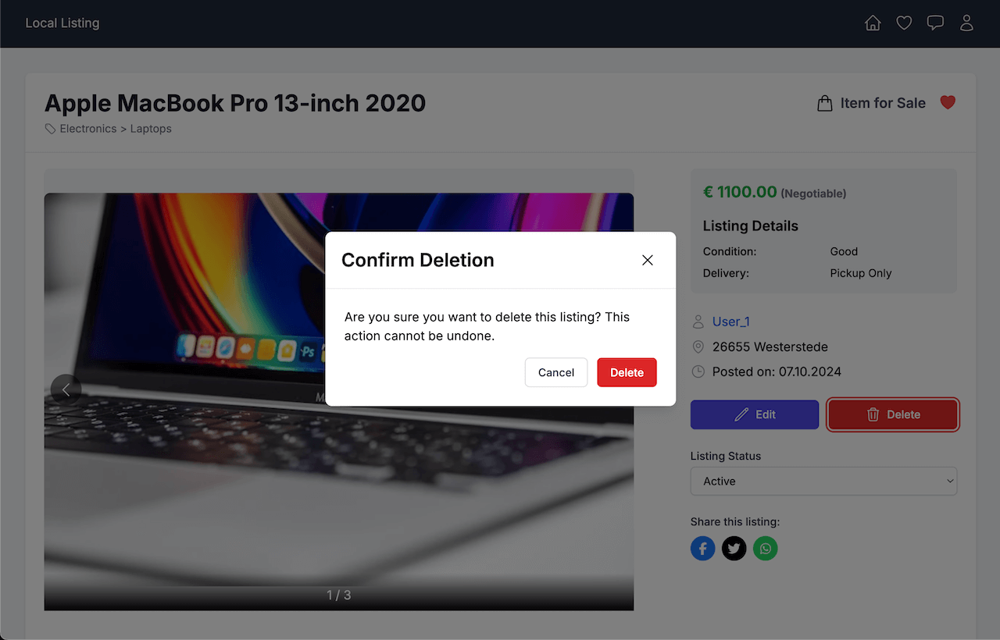

## Favorites

- **Favorite Listings:** Allows users to mark listings as favorites and access them from their profile.
  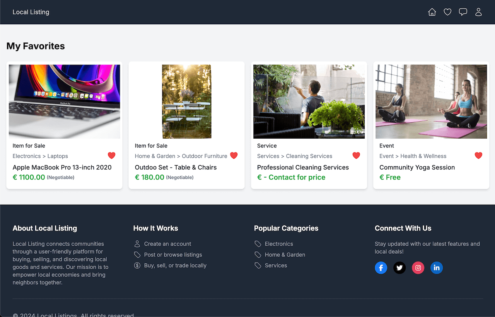

## Messaging

- **Messaging System:** Enables users to send and receive messages. Includes unread message count, real-time updates with polling, and a dedicated messages page.
- **Conversation List:** Displays all user conversations, grouped by contact.
- **Message Input:** A responsive input field for sending new messages.
- **Message List:** Displays messages in a conversation, with new messages appearing at the top.
- **Toast Notifications:** Toast notifications alert users to new messages while navigating the platform.

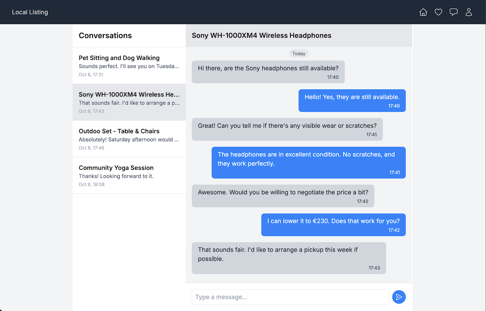

## User Management

- **User Registration & Login:** Users can create an account, log in, and reset their password.
- **Forgot Password:** Allows users to reset their password via email.
- **Profile Management:** Users can update their personal details, change passwords, view their public profile, and delete their account.
- **Public Profile View:** Users can view public profiles of others, including listings and basic information.

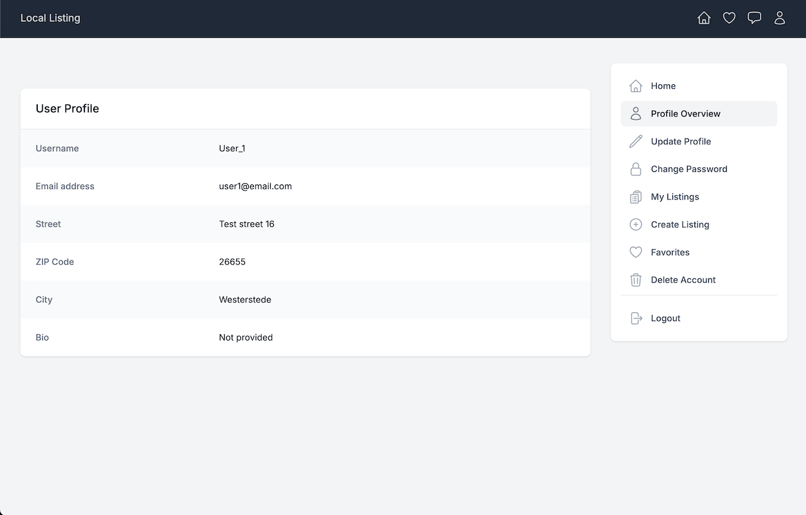
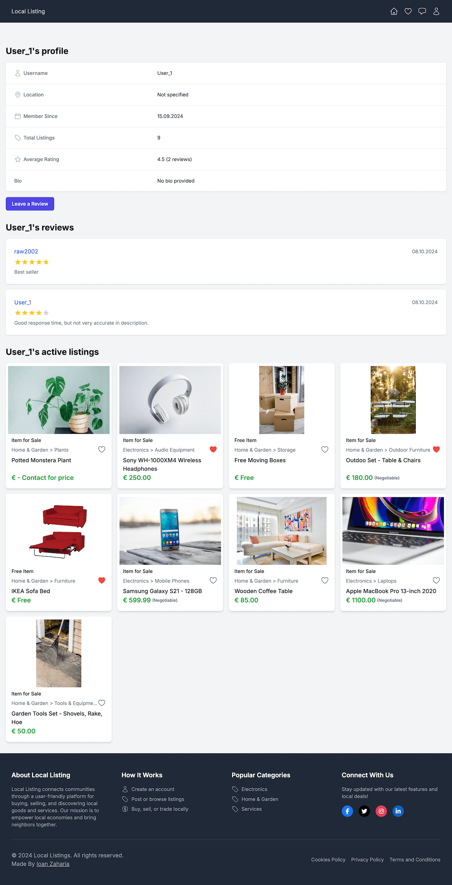

## Authentication Features

- **User Registration:** Users can register for an account by providing their email, password, and personal details. The registration process includes form validation for secure and correct user input.
  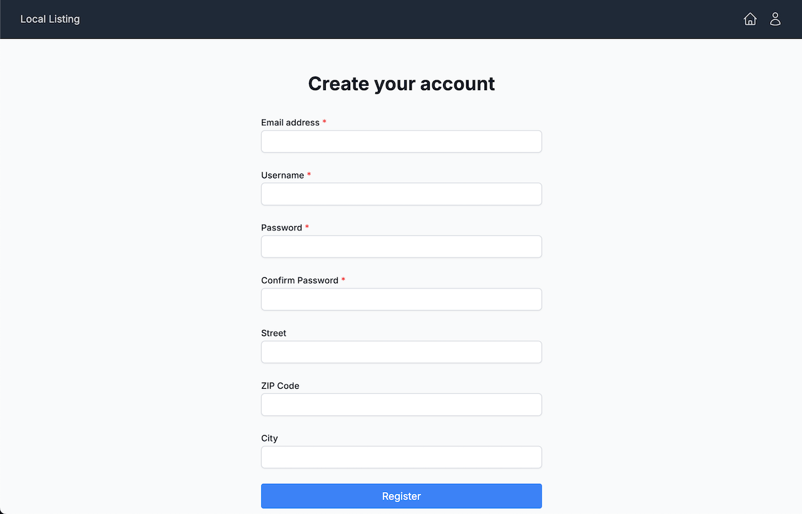

- **Login:** Registered users can log in by entering their email and password. The login form includes validation checks and error handling to ensure a smooth user experience.
  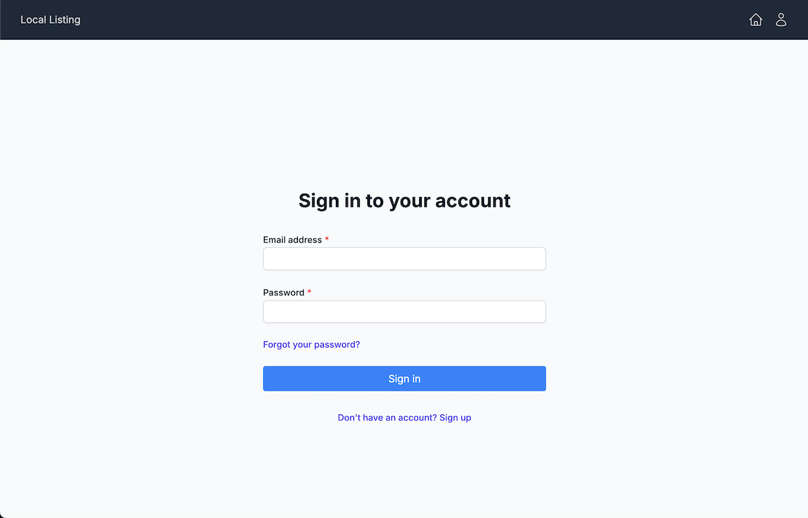

- **Forgot Password:** Users who forget their password can request a reset link via email. This feature integrates securely with the backend to ensure password recovery.
  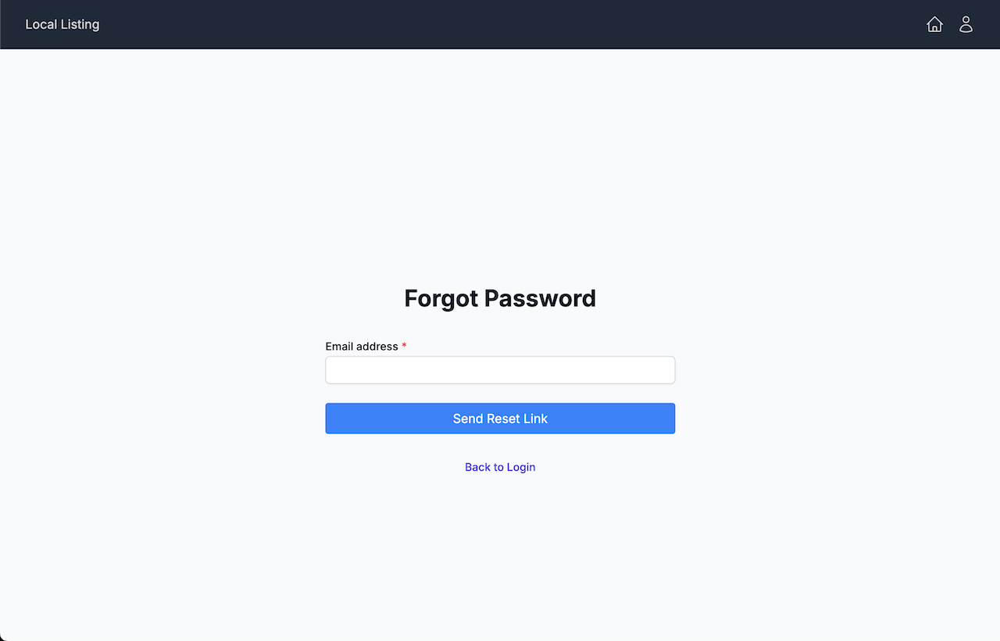

## Error Handling

- **Custom Error Pages:** Includes custom-designed 401 (Unauthorized), 403 (Forbidden), 404 (Not Found), and 500 (Server Error) pages to improve user experience in case of issues.

## Filters

- **Advanced Filtering:** Users can apply filters based on categories, price, location, and condition to refine search results.
- **Active Filters Display:** Displays all active filters with the ability to remove individual filters dynamically.

## Reviews

- **Review System:** Users can leave reviews on listings, providing a feedback mechanism for quality assurance.
- **Review List:** Displays all reviews for a listing with user ratings and comments.
- **Review Form:** A form for users to submit new reviews.

## Policies and Legal Pages

- **Terms and Conditions:** A page outlining the terms of service for the platform.
- **Privacy Policy:** A page outlining how user data is collected and managed.
- **Cookies Policy:** A dedicated page explaining the platform's use of cookies and local storage.

## Additional Features

- **Loading Spinner:** Displays a loading spinner when data is being fetched.
- **Skeleton Loader:** Placeholder skeletons are shown when content is loading.
