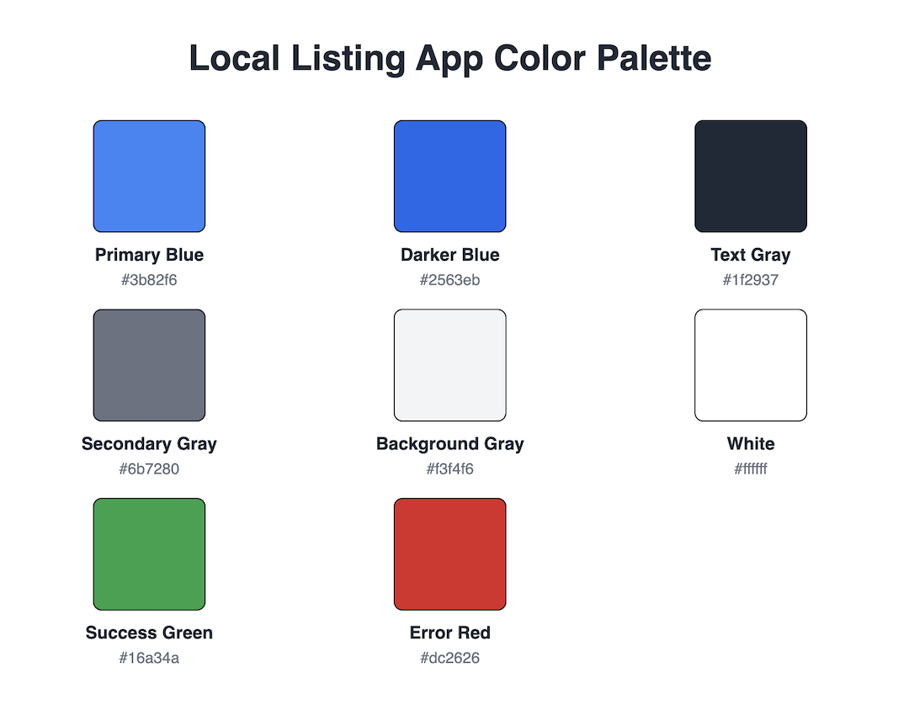
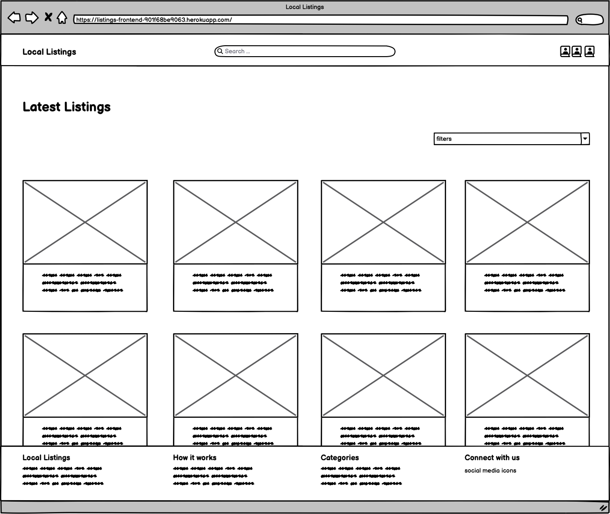
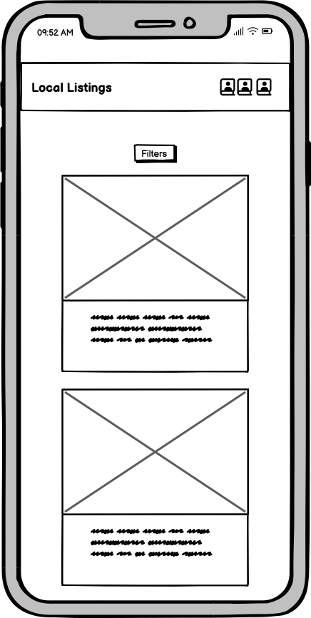
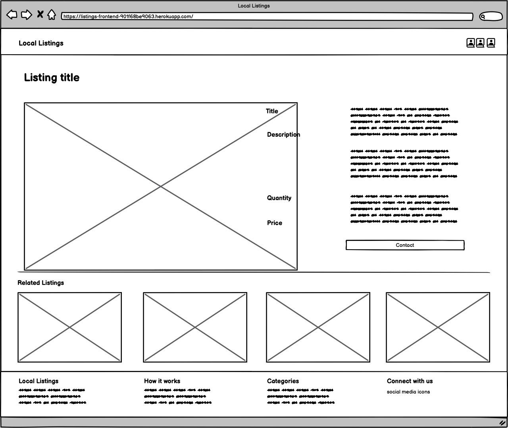
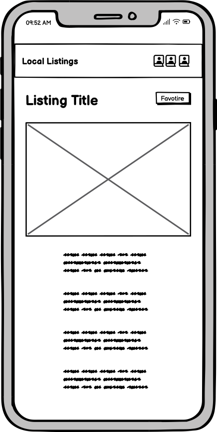
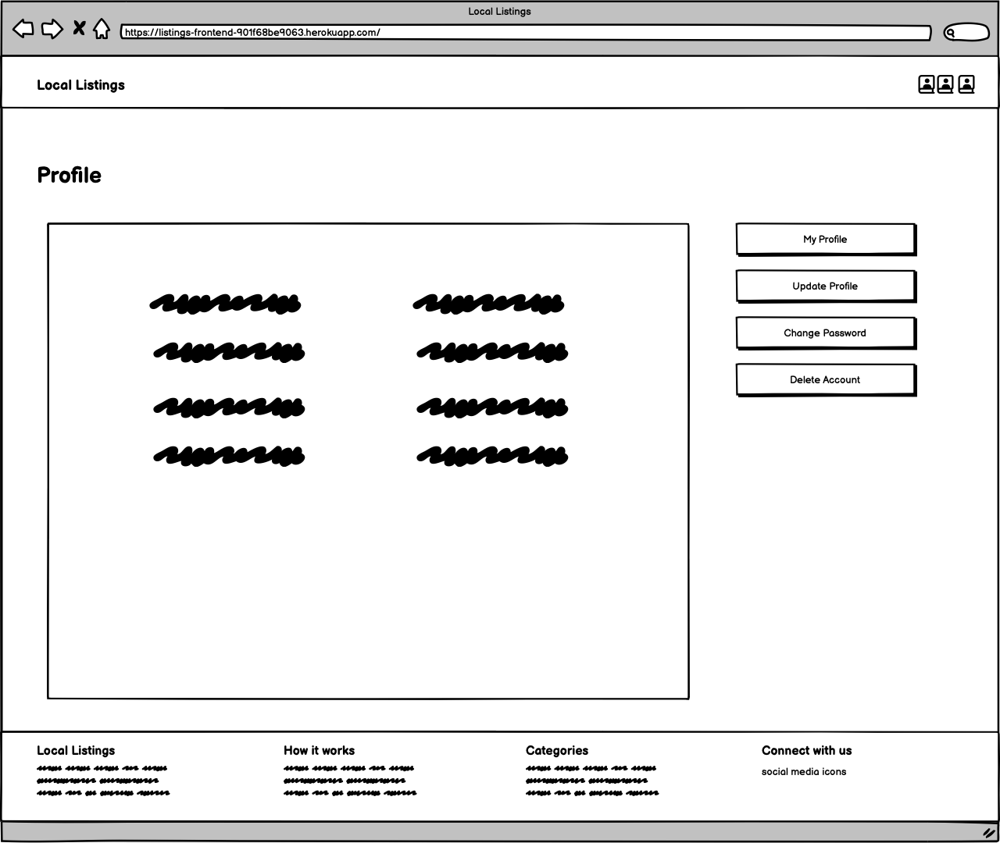
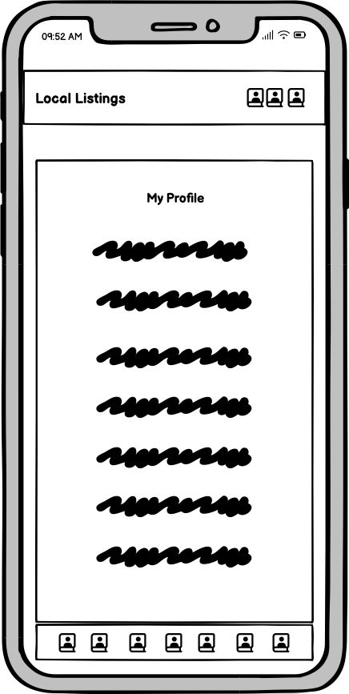
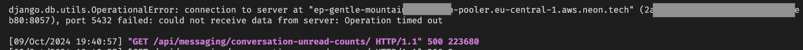

# Local Listing

## Table of Contents

1. [Project Overview](#project-overview)

   - [Key Features](#key-features)

2. [Target Audience](#target-audience)

3. [Business Model](#business-model)

4. [Features](#features)

   - [Key Features Summary](#key-features-summary)
   - [Additional Features Summary](#additional-features-summary)

5. [User Experience (UX)](#user-experience-ux)

   - [Project Goals](#project-goals)
   - [Design Choices](#design-choices)
     - [Color Scheme](#color-scheme)
     - [Typography](#typography)
     - [Imagery](#imagery)
     - [Layout](#layout)
     - [Wireframes](#wireframes)

6. [Technologies Used](#technologies-used)

   - [Languages](#languages)
   - [Frameworks & Libraries](#frameworks--libraries)
   - [Backend and Database](#backend-and-database)
   - [Other Tools & Services](#other-tools--services)

7. [Agile Methodology](#agile-methodology)

   - [Key Agile Elements](#key-agile-elements)
   - [Tools Used](#tools-used)

8. [Version Control](#version-control)

9. [Deployment](#deployment)

10. [Testing](#testing)

11. [Issues and Bugs](#issues-and-bugs)

12. [Future Features](#future-features)

13. [Credits](#credits)

14. [Developer Thoughts](#developer-thoughts)

## Project Overview

**Local Listing App** is a modern web application designed to allow users to create, manage, and browse local listings in a community-focused marketplace. The application provides a seamless experience for users to list items for sale, communicate via messages, and engage with local sellers and buyers.


The project utilizes a responsive design, ensuring compatibility with devices ranging from mobile phones to desktops. Built using **React** on the frontend, the app interacts with a Django backend REST API to provide real-time updates and dynamic data management.

### Key Features:

- **User Authentication & Authorization**:

  - The app provides a secure user authentication process using modern encryption standards. Users can register and log in securely, with the system handling password protection and reset functionalities.
  - The profile management section allows users to update personal information such as their name, email, and password, ensuring a user-friendly account management experience.
  - An early implementation of user address is included, allowing users to specify their location for local listings. This feature will be expanded in future versions to support location-based searches and to provide users the ability to show or hide their location.

- **Listings Management**:

  - Users can create detailed listings by providing a title, description, price, and images of the product. Each listing goes through validation checks to ensure completeness and clarity. Users have the ability to edit their listings at any time. When listings are no longer needed, users can delete them with a single click.
  - **Advanced Features**: Listings can include additional options like product categories, condition (new/used), and custom tags. The app can also handle multiple images per listing, giving buyers a complete view of the product.

- **Messaging System**:

  - The integrated messaging system allows users to communicate, offering a chat-like interface that makes interactions feel instant and natural. Each conversation is grouped by the listing and user, ensuring that messages are organized and easy to follow.
  - The messaging interface is designed to work across all devices and supports notifications when new messages are received. A timestamp feature, formatted using the **date-fns** library, clearly indicates when messages were sent, providing users with full context.
  - Current implementation is done using normal polling, but future versions will include real-time messaging using **Firebase** or **Socket.io** for instant updates. (due to time constraints, this feature was not implemented in the current version)
  - **Future Enhancements**: The messaging system will be expanded to include push notifications, ensuring that users are alerted to new messages even when they are not actively using the app.

- **Favorites**:

  - Users can mark listings as favorites, adding them to a wishlist for future reference. This helps buyers keep track of items they are interested in purchasing later.

- **Search & Filters**:

  - A powerful search engine allows users to look for specific products by entering keywords into the search bar. Users can refine their search results with filters, such as product categories, price ranges, and so on. The filters dynamically update the product listings, helping users quickly narrow down their options.
  - The filtering system is designed to work in real-time, meaning users can instantly see results as they adjust their preferences. This feature is particularly useful in areas with a high number of listings.
  - A card placeholder was used to maintain the layout consistency when loading and filtering listings, improving the overall user experience. This ensures that the user experience remains smooth and uninterrupted.

- **Responsive and Mobile-First Design**:

  - The app is built with a mobile-first approach using Tailwind CSS, ensuring that it performs well across devices, from desktops to smartphones. The UI components adjust dynamically to different screen sizes, providing an optimal experience for mobile users.

- **Error Handling & User Feedback**:

  - Customized error messages are displayed for common issues like invalid login credentials, server errors, or unauthorized access to restricted pages. These errors are handled gracefully with user-friendly messaging and redirection options to guide users back to the correct page.
  - **Toast Notifications**: The app uses real-time notifications to inform users of important actions. These toast notifications ensure users stay informed without interrupting their experience.

- **Social Sharing**:

  - The app includes social sharing buttons for users to easily share listings across popular platforms like Facebook, X, and Whatsapp, expanding the reach of their listings.

- **Accessibility**:

  - The app follows best practices for web accessibility, ensuring that it is usable by people with disabilities. ARIA labels, keyboard navigation, and screen-reader friendly content make the app inclusive for all users.

- **Scalability & Performance**:
  To mention a few scalability and performance features:

  - data caching and cache invalidation to reduce server load and improve response times;
  - modular design for easy feature expansion
  - a good use case of React's hooks, context API, custom hooks for state management, utility functions, and most importantly, the use of React's useCallBack hook to optimize performance and unnecessary re-renders.

  The app is built with scalability in mind, leveraging modern frameworks to handle increased traffic and user activity as the platform grows.
  Many of those features are planned for future versions, including payment integration, location-based search, and real-time messaging. The app is designed to evolve and adapt to user needs over time, ensuring that it remains relevant and valuable to its users.

- **Future-Proofed Design**:

  - The app’s architecture is designed to easily accommodate new features and updates, ensuring it remains maintainable and adaptable as user needs evolve.
  - Due to time constraints, some further optimizations and refactoring were not implemented in the current version but are planned for future iterations. These include code splitting, lazy loading, and further performance enhancements to ensure the app remains fast, responsive, and scalable.

  Further features description and screenshots can be found in the [Features](./FEATURES.md) documentation.

[Back to top](#local-listing)

## Target Audience

The **Local Listing App** is designed to cater to a diverse group of users who participate in buying, selling, and engaging with their local community. The platform’s flexibility and ease of use make it a valuable tool for different types of users, including:

- **Local Residents**:

  - Individuals who want to buy or sell items within their local area. This app provides a platform for neighbors to easily exchange goods and services without the need for shipping or complex transactions. Local residents benefit from the proximity and ease of meeting in person to finalize transactions, fostering a sense of community.

- **Small Business Owners**:

  - Local small businesses and entrepreneurs looking for a marketplace to list their products and services. The app allows them to reach customers within their geographical area, making it ideal for promoting local craftsmanship, artisanal goods, or niche products that might not be available in large commercial platforms. Business owners can create detailed listings, manage orders, and communicate directly with customers.

- **Casual Sellers**:

  - Users who occasionally sell second-hand items, collectibles, or unique goods. Whether it's a household item that’s no longer needed or a one-time sale of handcrafted goods, casual sellers can easily list their products without needing a complex storefront. The simplicity of creating, managing, and updating listings makes the platform ideal for casual use.

- **Buyers Seeking Local Deals**:

  - Individuals who are interested in supporting local commerce by purchasing items and services from sellers in their community. By using the app, buyers can find great deals on second-hand goods, locally-produced items, or special services, all while minimizing shipping costs and delivery times. The platform’s search and filtering features make it easy for buyers to find exactly what they’re looking for in their neighborhood.

- **Frequent Shoppers**:

  - Users who regularly browse listings for new and interesting products. For frequent shoppers, the app provides a convenient way to search, filter, and manage their favorite items. The ability to mark listings as favorites, receive notifications on price changes, and communicate directly with sellers makes the app an essential tool for savvy local buyers.

- **Sustainable Shoppers**:

  - Users who prefer to purchase pre-owned or locally-made products in an effort to support sustainable shopping practices. By providing a platform for local sales and reducing the need for long-distance shipping, the app aligns with the growing trend of eco-conscious buying and selling.

This broad target audience highlights the app’s versatility, making it an attractive solution for both buyers and sellers who want a localized and community-focused experience.

This app caters to users of all technical backgrounds, from tech-savvy individuals to those who are less experienced with technology, providing a simple and intuitive interface.

[Back to top](#local-listing)

## Business Model

The **Local Listing App** operates as a community-driven marketplace, connecting local buyers and sellers. It offers a platform for individuals, casual sellers, and small businesses to list items for sale, fostering a local economy and promoting neighborhood-based commerce. While the current implementation does not include monetization strategies, the following potential revenue streams and premium features can be introduced in future versions to both enhance user experience and generate income.

### Revenue Streams

1. **Listing Fees**:

   - The app can allow sellers to post a limited number of listings for free, which encourages initial user engagement. To generate revenue, sellers could be offered the option to purchase **premium listings** that gain higher visibility through featured placements or enhanced search priority. This would particularly appeal to users looking to boost their listings in a competitive local market.

2. **Subscription Plans**:

   - **Business Accounts**: A subscription model targeted at small businesses or frequent sellers could provide access to unlimited listings, advanced analytics, and premium tools to help manage sales. These subscriptions may include features such as promoted listings, enhanced seller profiles, and insights into listing performance (e.g., views, inquiries).
   - **Personal Accounts**: Casual sellers who use the platform intermittently can opt for a lower-tier subscription that increases their listing allowance and provides access to promotional tools (e.g., discount coupons for buyers or promotional badges on listings).

3. **In-app Advertising**:

   - Local businesses could purchase advertising space on the platform. These ads would be tailored to specific audiences, based on their location and buying preferences. This localized advertising model would allow businesses to promote their goods or services directly to a nearby, relevant audience, generating additional revenue for the platform.
   - Ads could appear as banners on the homepage or within search results, without disrupting the user experience.

4. **Transaction Fees**:

   - With the introduction of an in-app payment system, the platform could generate revenue by charging a small **transaction fee** for each payment processed through the app. This fee could be applied as a percentage of the sale or a flat rate, providing a stable and scalable income stream as the user base grows.
   - Secure payment gateways like **Stripe** or **PayPal** could be integrated to handle transactions, giving buyers and sellers peace of mind when making purchases through the platform.

5. **Promoted Listings & Sponsorship**:

   - Sellers looking to increase the visibility of their listings can purchase **sponsored slots**, where their items are displayed at the top of relevant search results or featured on the homepage. This helps drive traffic to their listings and increases sales potential.
   - Local businesses could also sponsor specific categories or events within the platform, tying their brand to certain types of products or promotions.

6. **Exclusive Seller Features**:
   - Offering **tiered access** to advanced seller tools, such as bulk listing uploads, detailed analytics (buyer demographics, listing performance), and automatic price reduction features, would entice high-volume sellers and businesses to invest in premium plans.

### Value Proposition

- **For Sellers**:

  - The app provides an intuitive interface for sellers to create and manage listings, communicate with potential buyers, and monitor listing performance. The availability of premium options, such as featured listings and analytics, helps sellers gain visibility and scale their business locally. The ability to manage orders and respond to inquiries through the app creates a streamlined sales process.

- **For Buyers**:
  - Buyers benefit from a **simple and efficient** platform for discovering local products. The app’s **search and filter** features make it easy to browse listings based on location, product type, and price range. Buyers can also save their favorite items, receive notifications on price changes, and engage in secure transactions with local sellers.
  - The app fosters a sense of community by allowing buyers to support local businesses and individuals, reducing the need for long-distance shipping and promoting sustainability.

By balancing free services with premium offerings, the app can grow sustainably, providing value to both buyers and sellers while generating revenue to support ongoing development and maintenance.

## Features

[Back to top](#local-listing)

### Key Features Summary

- **User Authentication**:

  - The app implements a secure authentication system allowing users to register, log in, and log out. Users can manage their profiles and access personalized features, such as managing listings and messages. The authentication process is secured using industry-standard encryption and token-based authentication to ensure data privacy and security.
  - The system supports session persistence, meaning users remain logged in until they manually log out, improving the overall user experience.

- **Listings Management**:

  - Users can create new listings by providing details such as title, description, price, and uploading images to visually showcase their items. Sellers can easily edit or update existing listings to keep information accurate and relevant or delete items they no longer wish to sell.
  - **Multiple Image Upload**: Each listing can include multiple images, giving buyers a more detailed view of the product. This enhances transparency and builds trust between buyers and sellers.
  - **Dynamic Listings**: Listings are dynamically updated on the homepage, ensuring users always see the latest items available for sale.

- **Messaging System**:

  - The app features a built-in messaging system that enables users to communicate directly with each other regarding listings. Messages are displayed in a chat-style format for ease of use, allowing users to ask questions, negotiate prices, and coordinate the sale in real time. The messaging system is intuitive, providing clear time stamps and grouping conversations by listing.
  - **Real-Time Updates**: Messages are updated in real-time, ensuring that users can respond quickly without needing to refresh the page. This feature mimics the experience of popular messaging platforms, making it familiar and easy to use.

- **Favorites Management**:

  - Users can mark specific listings as favorites, creating a personalized list of items they are interested in. This list is easily accessible from the user’s profile and allows buyers to track products they may want to purchase later.
  - Users are notified when favorite listings are updated or when the price changes, helping them stay informed without having to repeatedly check the app.

- **Responsive Design**:

  - The app is fully responsive, ensuring that it works seamlessly across all device types—desktop, tablet, and mobile. The design adapts to different screen sizes, maintaining usability and functionality without compromising on user experience.
  - **Mobile Optimization**: The app is particularly optimized for mobile users, with touch-friendly navigation, scrollable content, and a layout that simplifies interactions on smaller screens.

- **Error Handling**:

  - The app has custom error pages for common issues such as 404 (page not found), 500 (internal server error), and unauthorized access. These error pages are designed with a user-friendly message and helpful navigation options, guiding users back to the correct path instead of leaving them stranded. This reduces user frustration and provides a polished experience, even when things go wrong.

- **Search and Filtering**:
  - The app includes a powerful search engine that allows users to search for listings using keywords. Additionally, users can apply filters based on product categories, price ranges, and item availability, refining the results to find exactly what they need.
  - The search results are dynamically updated, ensuring users get relevant listings instantly. This is particularly useful for users browsing through a large number of listings and wanting to narrow down options quickly.

### Additional Features Summary

- **Password Reset**:

  - In case users forget their login credentials, the app offers a secure password reset process via email. Users can request a password reset link, which allows them to set a new password without needing to contact support. This enhances user convenience and minimizes friction when trying to regain access.

- **Profile Management**:

  - Users have access to a comprehensive profile management system where they can update personal information such as their name, email, and password. This ensures users can keep their account details up-to-date.
  - **Profile Privacy**: The profile page also includes options for users to control the visibility of their listings and public interactions, enhancing the privacy of sensitive information.

- **Image Upload**:

  - The app supports image uploads for each listing, allowing sellers to visually present the items they are selling. Multiple images can be uploaded, and each image is displayed prominently on the listing page, giving potential buyers a clear understanding of the product.

- **Conversation Grouping**:

  - The messaging system groups messages into conversations, making it easier for users to track their discussions with multiple buyers or sellers. Each conversation is organized by listing, so users can quickly reference the relevant product when communicating with other users. This feature helps keep communication clear and streamlined, especially for users managing multiple transactions.

- **Push Notifications (Planned Feature)**:

  - In future iterations, the app will include push notifications to alert users of new messages, updates to favorite listings, or important announcements. This will improve real-time engagement and keep users informed without needing to be actively logged into the app.

- **Location-Based Search (Planned Feature)**:

  - The app will introduce location-based filtering, allowing users to find listings near their current location or a specified area. This will enhance the local commerce aspect, making it easier for buyers to connect with sellers in their neighborhood.

[Back to top](#local-listing)

## User Experience (UX)

### Project Goals

The primary goal of the **Local Listing App** is to provide an intuitive, secure, and responsive platform that connects buyers and sellers within their local community. The app strives to create a seamless experience where users can easily browse, manage, and interact with listings. The key objectives are:

- **Connecting Local Buyers and Sellers**: The app facilitates easy connections between users by providing a streamlined, user-friendly interface where buyers and sellers can interact directly and securely.
- **Enhanced Communication Tools**: A built-in messaging system allows users to communicate effortlessly, ensuring inquiries about listings can be handled in real time. This simplifies negotiations and enhances the buying/selling process.
- **Mobile-First, Responsive Design**: The app is designed with a mobile-first approach, making it fully responsive and ensuring that users have a smooth experience on all device types, whether they are on desktops, tablets, or smartphones.
- **Secure Transactions and Privacy**: By implementing robust authentication, encrypted communications, and privacy controls, the app creates a safe environment where users can interact with confidence. This is particularly important for a marketplace platform, where trust is critical to success.

### Design Choices

#### Color Scheme

The color scheme for the **Local Listing App** was chosen to emphasize clarity and professionalism while remaining approachable. A neutral palette consisting of grays and whites creates a clean, minimalist background that ensures content is easy to read and navigate. Accent colors such as blues and greens are used to highlight important elements like buttons, notifications, and key user actions, drawing attention where it’s needed without overwhelming the user.

- **Primary Colors**: Light grays and whites for background elements.
- **Accent Colors**: Blue for primary call-to-actions (e.g., buttons) and green for notifications or positive feedback (e.g., successful listing creation or message sent).

This palette helps establish a professional yet friendly aesthetic, making the app inviting to all types of users.


#### Typography

A modern and highly readable font, **Inter**, is used throughout the app to ensure legibility across devices and screen sizes. The typography hierarchy is clear and structured, guiding users effortlessly through the interface:

- **Headings**: Larger, bold fonts are used for headings and titles to grab attention and provide structure to pages.
- **Body Text**: Smaller, regular-weight fonts are used for paragraphs, ensuring that content is easy to read on any screen size without strain.
- **Buttons & Links**: Button text is bold and clearly visible, using accent colors to indicate interactivity.

#### Imagery

- **Placeholder Image**: A neutral placeholder image is used for listings that do not have uploaded images. This maintains a consistent layout and ensures that all listings are visually represented, even if no images are available.
- **Icons**: Simple, clean icons are used throughout the app to indicate actions and navigation. These icons are easily recognizable and help users quickly understand the purpose of each element.

#### Layout

The app layout is designed with a **mobile-first** approach, ensuring that it provides a seamless experience across devices of all sizes. Key layout choices include:

- **Intuitive Navigation**: The app features a straightforward navigation bar at the top of the screen, providing easy access to key sections such as listings, messages, and profile. On mobile devices, the navigation is simplified into a hamburger menu for easy access.
- **Card-Based Listings**: Product listings are displayed in a card-based layout, ensuring each item is presented clearly with a thumbnail image, title, price, and brief description. This layout is scalable, working equally well on mobile, tablet, and desktop screens.
- **Consistent User Journey**: Key features like search, listing creation, and messaging are always easily accessible, providing a consistent user journey across the app. Each step in the process—from browsing listings to messaging a seller—is designed to be intuitive, reducing friction and enhancing the overall user experience.

#### Wireframes

To ensure a responsive and user-friendly design across various devices, wireframes were created for mobile and desktop views.








[Back to top](#local-listing)

## Technologies Used

The **Local Listing App** was built using modern web technologies to ensure scalability, maintainability, and optimal performance. Each technology choice contributes to creating a responsive, efficient, and user-friendly platform.

### Languages

- **JavaScript**:
  - JavaScript serves as the primary programming language for the frontend, powering the interactivity and dynamic behavior of the application. It enables features like real-time messaging, smooth navigation, and seamless interactions across the app.
- **HTML5**:
  - HTML5 is used to structure the content of the application. Semantic HTML ensures that the application is accessible, SEO-friendly, and performs well across modern browsers.
- **CSS3**:
  - A very small amount of custom CSS is used to style the app, with the majority of styling handled by the **Tailwind CSS** utility-first framework.

### Frameworks & Libraries

- **React version 18.3.1**:

  - React is the core framework used to build the app's user interface. By utilizing React’s component-based architecture, the application is modular and easy to maintain. Components are reusable, making development faster and more efficient while ensuring a consistent look and feel across the app.
  - React’s virtual DOM optimizes performance, ensuring that only the necessary components re-render when data changes.
  - A very important aspect in the development process and further local installation regarding React ecosystem is the Node and npm versions. The app was developed using Node version 20.17.0 (LTS) and npm version 10.8.2. A complete list of dependencies and their versions can be found in the package.json file.

- **React Router**:

  - React Router manages client-side routing, allowing the app to behave like a single-page application (SPA). It provides a seamless navigation experience, enabling users to move between pages without full page reloads, ensuring fast transitions and improved user experience.

- **Axios**:

  - Axios is used to handle asynchronous HTTP requests, enabling the app to interact with the backend’s REST API. Axios simplifies API calls for fetching data (e.g., listings, user messages) and submitting information (e.g., creating new listings, sending messages) in a structured and manageable way.

- **React Toastify**:

  - React Toastify is implemented to provide non-intrusive notifications and alerts. It ensures that users are informed about important actions (e.g., message sent, listing updated) without interrupting their workflow. Toast notifications contribute to a smooth, engaging user experience.

- **Heroicons**:

  - Heroicons are used throughout the app for iconography, providing clean and scalable icons that complement the design. These icons are integrated into navigation menus, buttons, and notifications, contributing to the overall modern aesthetic of the app.

- **date-fns**:
  - The **date-fns** library handles all date and time formatting within the app, particularly in the messaging system. This library ensures that message timestamps are displayed in a readable and localized format, enhancing the clarity of user conversations.

### Backend and Database

- While the frontend interacts with a **REST API** to retrieve and submit data, the database is managed by the backend (**Django REST framework**). The database stores critical information such as user accounts, listings, messages, and profile details. The frontend communicates with the database through API endpoints to ensure that data is displayed in real-time and remains consistent.

### Other Tools & Services

- **Git**:

  - Git is used for version control, ensuring that the development process is efficient and organized.

- **GitHub**:

  - GitHub serves as the remote repository for managing the project’s codebase.

- **Heroku**:

  - The app is deployed on **Heroku**, a cloud platform that provides hosting services for web applications. Heroku ensures that the app is accessible to users online and can scale as needed to accommodate increased traffic.

## Agile Methodology

The development of the **Local Listing App** followed Agile principles to ensure an iterative, flexible, and user-centric approach.

### Key Agile Elements

- **Sprint Planning**:

  - The development process was divided into multiple sprints, each lasting between 1-2 weeks. Sprint planning also allowed me to estimate the complexity of tasks and assign priorities based on this.

- **Kanban Board**:

  - A **Kanban board** was used to visualize and track the progress of tasks during the project. Tasks were organized into columns, providing a clear overview of what needed to be done and how work was progressing. This setup ensured that no task was overlooked, and it made it easy to identify potential bottlenecks in the development process.

  Kanban board can be accessed [here](https://github.com/users/zioan/projects/6).

- **User Stories**:
  - All features in the app were guided by **user stories**, which were crafted to represent the needs and expectations of the end-users. User stories were broken down into manageable tasks that could be completed within a single sprint.
  - The user stories were prioritized using the **MoSCoW method**:
    - **Must have**: Essential features that were critical to the app’s functionality.
    - **Should have**: Important features that added value but were not essential for the minimum viable product (MVP).
    - **Could have**: Nice-to-have features that would enhance the user experience but could be deferred.
    - **Won't have**: Features that were deemed unnecessary for the initial release or could be considered for future iterations (especially due to time constraints).

A complete list of user stories including tests can be found in the [Testing](./TESTING.md) documentation.

### Tools Used

- **Obsidian**:

  - Obsidian was used to create and manage project documentation, including user stories, feature descriptions, and development notes.

- **GitHub Projects**:
  - GitHub Projects was integrated to keep track of development tasks alongside the codebase.

[Back to top](#local-listing)

## Version Control

Version control for the **Local Listing App** was managed using **Git** and hosted on **GitHub** to ensure efficient collaboration and tracking of changes throughout the development process.

### Tools and Workflow

1. **Development Environment**:

   - **VS Code**: Utilized as the primary IDE for development.

2. **Source Control Panel**:

   - VS Code's **Source Control** panel was used extensively to manage code changes, particularly when working on multiple components. This panel allowed easy visualization of changes and helped in logically grouping updates into meaningful commits.

3. **Commit Strategy**:

   - Given the interconnected nature of the React, changes often spanned across multiple files. The **diff viewer** in VS Code was used to carefully review changes before creating commits.
   - The commit messages were kept descriptive to ensure clarity of the project's evolution, making it easier for future maintainability.

4. **Key Git Commands**:

   - **`git add <file>`** or **`git add .`**: To stage changes.
   - **`git commit -m "descriptive message"`**: To commit changes with a meaningful message.
   - **`git push`**: To push the local commits to the GitHub repository.

5. **Remote Synchronization**:
   - Regularly used **`git pull`** to sync the local repository with the latest changes on the remote GitHub repository. This practice helped avoid conflicts after modifying the project board or issues.

[Back to top](#local-listing)

## Deployment

The **Local Listing App** was deployed using **Heroku**, a platform that provides easy deployment and scaling for modern web applications. Heroku’s dashboard was used to manage the deployment process, allowing for a straightforward setup and ongoing maintenance of the app.

### Deployment Process

1. **Creating a Heroku App**:

   - The first step in deploying the app was to create a new app on the Heroku dashboard. This process involved selecting a unique app name and configuring the region in which the app would be hosted.

2. **Connecting to GitHub**:

   - Once the app was created, Heroku’s **GitHub integration** was used to connect the Heroku app to the project’s GitHub repository. This integration allowed for automatic deployment from the repository’s main branch.
   - By enabling **automatic deploys**, every time new code was pushed to the main branch in GitHub, Heroku would automatically rebuild and redeploy the app. This ensured that the live application was always up to date with the latest changes.

3. **Environment Variables**:

   - Environment variables such as API keys and configuration settings were added through the Heroku dashboard under the **Config Vars** section. This secure method of managing sensitive information ensured that keys were not hard-coded into the app’s codebase.

4. **Build and Deployment**:

   - Heroku automatically handled the build process for the app. After detecting that the project was a **Node.js** app, Heroku installed the necessary dependencies and built the app using the `npm run build` command.
   - Once the build was complete, Heroku deployed the static assets to its servers, making the app live and accessible to users.

5. **Heroku Dashboard Management**:

   - The Heroku dashboard was used to manage the live app, including monitoring its performance, scaling resources, and reviewing deployment logs. If any issues arose during the deployment or runtime, the logs could be accessed from the dashboard for troubleshooting.

6. **Post-Deployment Testing**:

   - After each deployment, the app was tested to ensure that it functioned correctly in the live environment. This included testing all core features, such as user registration, listing creation, and messaging, to confirm that the app performed as expected on Heroku.

[Back to top](#local-listing)

## Testing

Extensive testing was conducted throughout the development of the **Local Listing App** to ensure that the application performed correctly across different devices, browsers, and scenarios. The testing process involved manual and automated testing, focusing on both core functionality and user experience.

### Manual Testing

A series of manual tests were performed on various features to verify functionality and usability. Key tests included:

1. **Functionality Tests**:

   - **User Authentication**: The registration, login, logout, and password reset flows were manually tested to ensure users could securely access and manage their accounts. Special attention was given to error handling, such as incorrect login attempts and invalid password resets.
   - **Listings Management**: All functionalities related to creating, editing, and deleting listings were tested. This included checking whether listings appeared correctly on the homepage, whether edits were saved, and if deleted listings were properly removed.
   - **Messaging System**: Sending and receiving messages were tested between multiple users. Tests ensured that messages appeared in real-time and that conversations were grouped correctly. Notifications of new messages were also checked for accuracy.
   - **Favorites**: Adding and removing listings from the favorites list was tested to confirm that user preferences were saved and retrieved accurately.
   - **Search and Filtering**: The search bar and filtering options were manually tested to verify that relevant listings were displayed according to search terms, categories, and price ranges.

2. **Responsive Design Testing**:

   - The app was tested across various devices (mobile, tablet, and desktop) to ensure that the design was fully responsive. Features such as navigation, messaging, and listing management were checked for usability on both small and large screens.

3. **Cross-Browser Testing**:
   - The app was tested on multiple browsers, including **Google Chrome**, **Mozilla Firefox**, **Safari**, and **Microsoft Edge**. Each core feature was verified for consistent performance across these environments, ensuring the app worked seamlessly for all users regardless of their preferred browser.

### Automated Testing

Due to time constraints, automated testing was not implemented in the current version of the frontend. However, future iterations of the **Local Listing App** will include automated testing using tools such as **Jest** and **React Testing Library** to ensure code quality and prevent regressions.

### Post-Deployment Testing

After the app was deployed to **Heroku**, further testing was conducted in the live environment to ensure that all features worked as expected in a production setting. The post-deployment tests included:

- **Core Features**: Testing critical features such as user authentication, listing creation, messaging, and search functionality in the live environment.
- **API Integration**: Verifying that the frontend correctly interacted with the backend’s API, ensuring data consistency and correct error handling.
- **Performance Testing**: Ensuring that the app performed well under typical usage scenarios, with acceptable loading times and smooth navigation.

A detailed testing report can be found in the [Testing](./TESTING.md) documentation.

Through comprehensive testing, the app was refined to ensure a robust and user-friendly experience across all platforms.

[Back to top](#local-listing)

## Issues and Bugs

During the development and testing phases of the Local Listing frontent, several issues were found and solved. Below is a summary of the known issues and some improvements that could be made in future iterations, as well as a list of some of the bugs that were encountered and fixed.

### Database Connection Consistency

Database connection (provided by Code Institute) seems to be inconsistent from time to time, leading to occasional connection errors. Fortunately, the frontend client handles these errors gracefully, triggering a 500 error message. Usually, refreshing the page resolves the problem and the issue is not persistent, but this can lead to a poor user experience and the feeling of an unstable platform.

This is a screen capture of the error message:


### Subcategory Filter Not Updating Properly

**Issue:** The subcategory filter was not updating correctly when a new category was selected. This resulted in outdated or irrelevant subcategories being displayed to the user.

**Cause:** The `useEffect` hook responsible for updating subcategories was not properly triggered when the category changed. This was due to missing dependencies in the hook's dependency array.

**Solution:** The `useEffect` hook was updated to include `formData.category` in its dependency array. This ensures that the hook runs whenever the selected category changes, fetching the correct subcategories for the new category. Additionally, the subcategory state is reset when a new category is selected to prevent displaying outdated options.

Key changes made:

1. Added `formData.category` to the `useEffect` dependency array.
2. Reset the subcategory value when updating form data for a new category.
3. Improved error handling in the subcategory fetching process.

### Incorrect Profile Rating Calculation and Reviews Count

**Issue:** The profile rating calculation and reviews count were inaccurate. The average rating was not updating correctly when new reviews were added or existing reviews were modified. Additionally, the reviews count was not properly reflecting the actual number of reviews.

**Cause:** The logic for calculating the average rating and updating the reviews count was flawed. It didn't account for updates to existing reviews and wasn't correctly handling the addition of new reviews.

**Solution:** The code was refactored to improve the calculation of average ratings and the tracking of review counts. Key changes include:

1. Added a `calculateAverageRating` function to compute the average rating from all reviews.
2. Implemented `initialAverageRating` to set the correct initial rating when loading profile data.
3. Updated the `handleReviewSubmitted` function to properly handle both new reviews and updates to existing reviews.
4. Introduced a `handleReviewDeleted` function to correctly update the average rating and review count when a review is deleted.
5. Modified the `getReviewsCountText` function to accurately reflect the number of reviews, including proper pluralization.

These changes ensure that the profile rating and review count are calculated accurately and updated in real-time as reviews are added, modified, or deleted.

### Inconsistent Listing Status Update

**Issue:** The listing status was not being consistently updated across the application when changed. This led to discrepancies between the actual status of a listing and what was displayed to users.

**Cause:** The update logic in the `updateListingStatus` function was not properly handling the `is_active` property of listings. Additionally, the cache invalidation was not comprehensive enough to ensure all relevant data was refreshed after a status update.

**Solution:** The code was refactored to address these issues:

1. Updated the `updateListingStatus` function in `useListings.js` to correctly handle both the `status` and `is_active` properties of a listing.
2. Modified the listing update logic to use a more precise condition for updating listing objects:
   ```javascript
   listing.id === id ? { ...listing, status: response.data.status, is_active: response.data.status === "active" } : listing;
   ```

[Back to top](#local-listing)

## Future Features

The **Local Listing App** has been designed with scalability and future enhancements in mind. Several features are planned for future releases to continually improve the user experience and expand the app’s functionality. These additions will help meet the evolving needs of the user base and keep the platform competitive in the market.

### 1. Real-time Notifications

- Implementing real-time notifications will ensure that users are instantly alerted to new messages, updates on their listings, or important alerts without needing to refresh the page. This will enhance engagement, allowing buyers and sellers to communicate more efficiently and stay updated in real time.

### 2. In-app Payments

- Adding a secure payment gateway (e.g., **Stripe** or **PayPal**) will enable users to complete transactions directly within the app. This will streamline the buying process by providing a secure and convenient way for buyers to pay sellers without needing to leave the platform.

### 3. Chat Enhancements

- Enhancements to the messaging system, such as typing indicators, message read receipts, and file-sharing capabilities, will improve communication between buyers and sellers. These features will provide a more interactive chat experience, making negotiations and inquiries more seamless.

### 4. Dark Mode

- A dark mode option will be introduced for users who prefer a darker theme or browse the app at night. This feature will improve accessibility by reducing eye strain and giving users the flexibility to switch between light and dark modes based on their preference or environment.

### 5. Mobile App Version

- Developing a dedicated mobile application for **iOS** and **Android** platforms will provide users with an even more optimized experience. The mobile app will include all core features of the web version while enhancing performance and usability for mobile users, ensuring that the platform remains accessible and engaging on all devices.

These features and many more (mentioned in this document in their respective sections) are planned for future development and will be rolled out in phases to continuously improve the app’s functionality and overall user experience. The focus remains on delivering features that add value to both buyers and sellers, enhancing the app’s utility and engagement over time.

[Back to top](#local-listing)

## Credits

The development of the Local Listing frontend was made possible thanks to various tools, and resources. Below is a list of credits for code, media, and tools that were instrumental in building this project.

A special thank to my mentor Spencer Barriball, who provided valuable guidance and feedback throughout the development process.

### Code and Inspiration

- **React Documentation**: The official React documentation was a valuable resource for understanding React concepts, hooks, and best practices. It provided clear examples and explanations that helped in building the app’s frontend.
- **Tailwind CSS Documentation**: The Tailwind CSS documentation was instrumental in learning how to use the utility-first framework effectively. The documentation provided detailed information on classes, configurations, and responsive design, enabling the creation of a visually appealing and responsive UI. The initial idea was to use **Tailwind UI** library, but I ended up using the utility-first framework.
- **React Router Documentation**: The React Router documentation was essential for implementing client-side routing in the app. It provided guidance on setting up routes, nested routes, and dynamic routing, ensuring that the app’s navigation was smooth and intuitive.
- **Axios Documentation**: The Axios documentation was helpful in understanding how to make HTTP requests in React. It provided examples of how to fetch data from APIs, handle responses, and manage asynchronous requests, which were crucial for interacting with the backend API.
- **React Toastify Documentation**: The React Toastify documentation was used to implement toast notifications in the app. It provided clear instructions on how to display notifications, customize styles, and handle different types of alerts, enhancing the user experience with real-time feedback.
- **Heroicons**: The Heroicons library provided a wide range of open-source icons that were used throughout the app. These icons added visual appeal to buttons, navigation elements, and notifications, contributing to a modern and cohesive design.
- **date-fns Documentation**: The date-fns library documentation was instrumental in understanding how to format dates and times in React. It provided examples of how to localize dates, format timestamps, and handle time zones, ensuring that message timestamps were displayed accurately and clearly.
- **Previous Coding Experiences**: Professional coding experiences in React and frontend development were instrumental in building the app. The knowledge gained from previous projects, coding challenges, and learning resources helped in applying best practices, optimizing performance, and creating a user-friendly interface.

### Content

- All written content, including placeholder listings, user messages, and descriptions, was created specifically for this project to simulate real-world interactions within the app.
- The structure and flow of the user interface content were based on user stories and intended to provide a smooth and intuitive experience.

### Media

- Product images displayed in the listings were sourced from , a free stock photo library that offers high-quality images for commercial use. The images were selected to represent a variety of products and showcase the app’s diverse listings.
- Icons and placeholders used in the application were sourced from [Heroicons](https://heroicons.com/), which offers a wide variety of open-source, scalable icons that match the app’s modern aesthetic.

Note on Code Used from Third-party Sources: The app was built from scratch, and no third-party code was directly copied or used in the project. All code was written by me, with inspiration and guidance from official documentation and previous coding experiences.

## Developer thoughts

Due to time constraints, some features and optimizations were not implemented in the current version of the app. However, the app was developed with scalability and future enhancements in mind.

Further refactoring and performance optimizations including API calls, state management, and component reusability are planned for future iterations.

The database connection errors that happens from time to time are a concern, and can lead to a poor user experience and the feeling of an unstable platform. This issue will be addressed in future versions to ensure a consistent and reliable database connection.

[Back to top](#local-listing)
