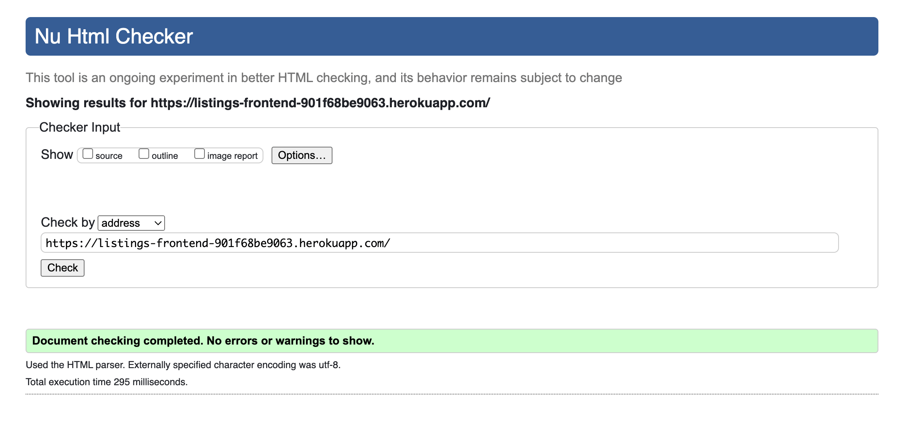
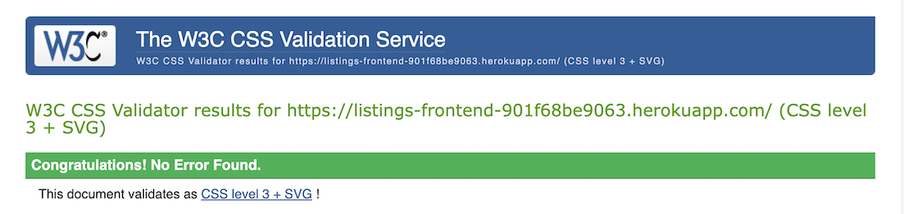
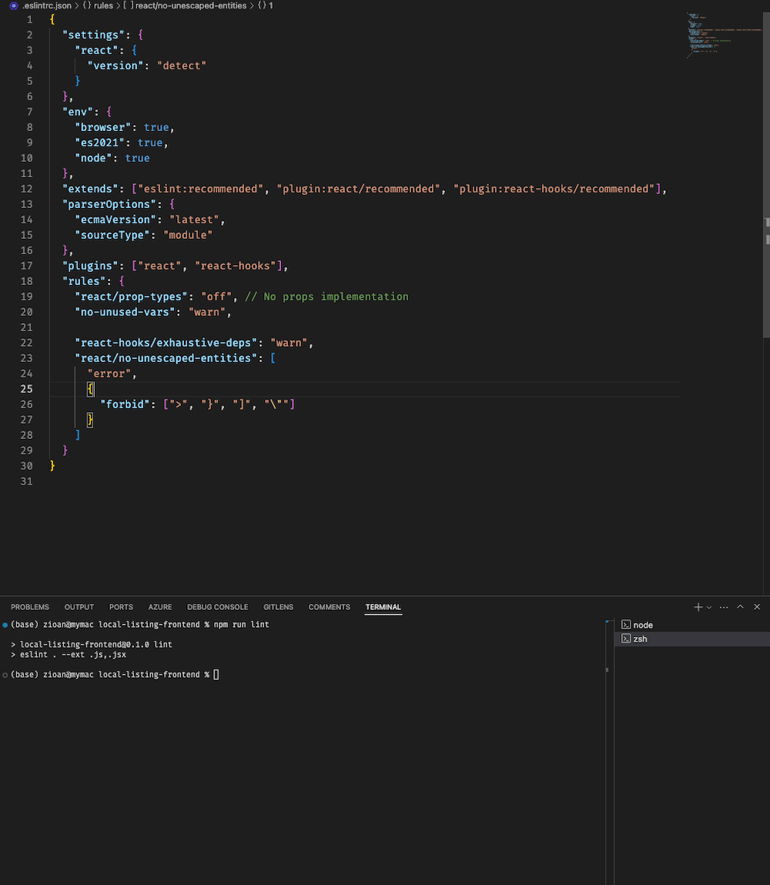
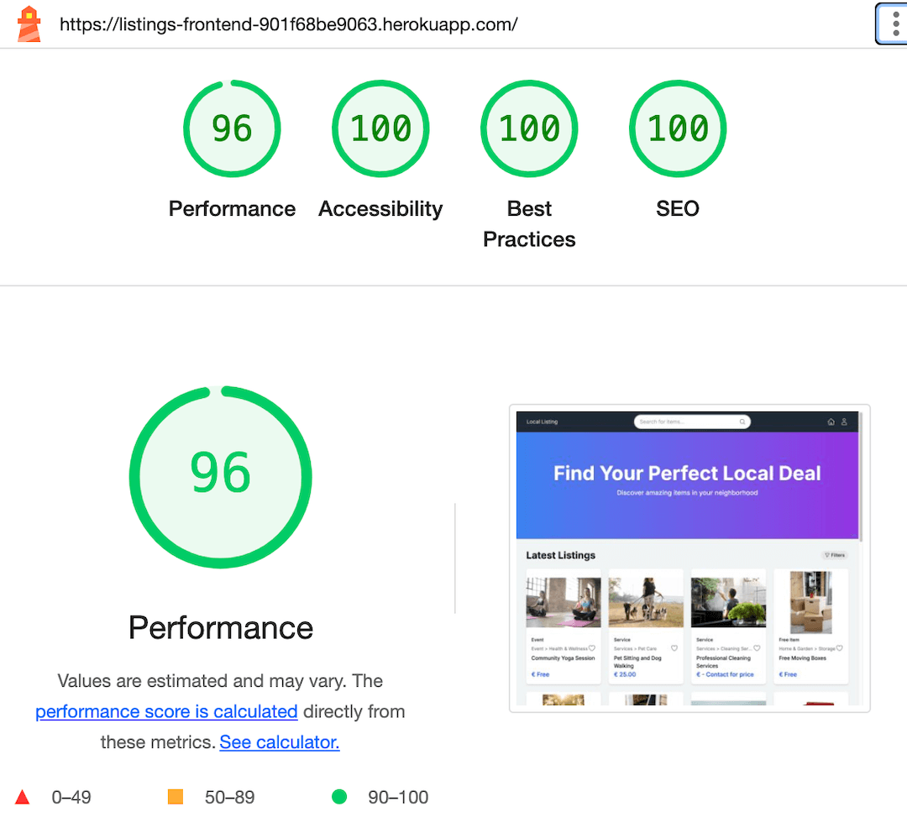
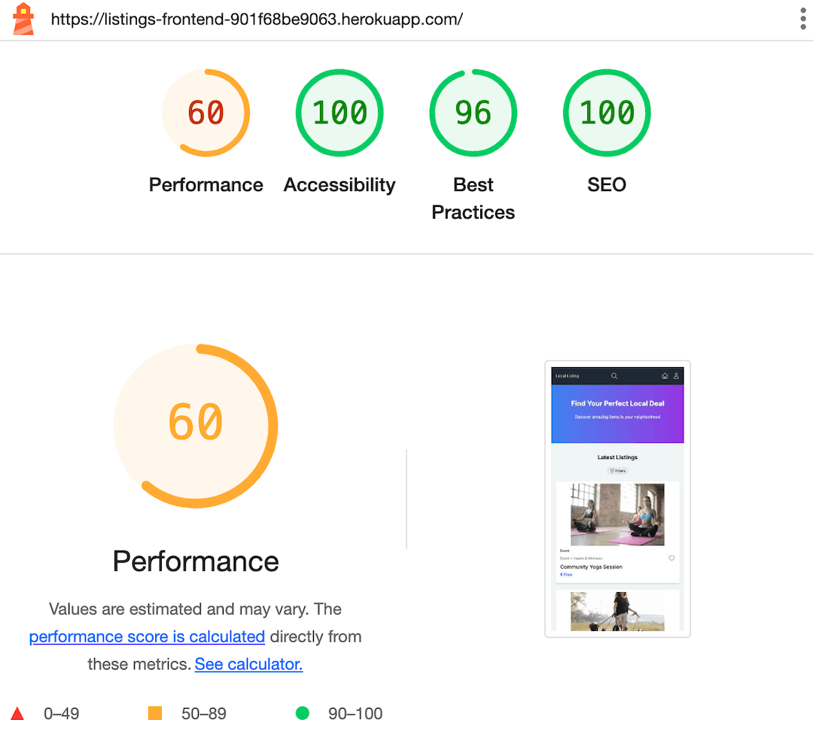

# Local Listing - Frontend Testing

## Code Validation

### HTML Validation

The HTML was validated using the W3C Markup Validation Service. As the project uses React components, the HTML was validated by copying the rendered HTML from the browser into the validator.



Results:

- No errors found
- No warnings found

### CSS Validation

Since this project uses Tailwind CSS, a small amount of custom CSS was used for additional styling. CSS was validated using the W3C CSS Validation Service.



Results:

- No errors found
- No warnings found

### ESLint Validation

The project uses ESLint to enforce code quality and consistency. The ESLint configuration file is included in the project, and linting was performed using the following command:

```bash
    npm run lint
```



- No errors found
- No warnings found

### React Component Testing

Due to time constraints, the React component tests were not implemented. However, the application was manually tested to ensure that all components render correctly and function as expected.

## Lighthouse Testing

Lighthouse was used to test the performance, accessibility, best practices, and SEO of the Local Listing application.

The tests were conducted on both desktop and mobile views.





The performance score is slightly lower on mobile views. All images have been optimized for web use, but further optimizations could be made to improve mobile performance. Due to time constraints, these optimizations were not implemented in the current version.

## Manual Testing

Manual testing was conducted across all major features and components of the Local Listing frontend application. The testing process covered functionality, usability, responsiveness, and cross-browser compatibility. All tests were performed on the following browsers:

| Browser         | Version        | Desktop | Tablet | Mobile | Notes                                           |
| --------------- | -------------- | ------- | ------ | ------ | ----------------------------------------------- |
| Google Chrome   | 127.0.6533.120 | ✅      | ✅     | ✅     | Fully responsive, all features functional       |
| Mozilla Firefox | 128.0.3        | ✅      | ✅     | ✅     | Smooth performance across all devices           |
| Safari          | 17.6           | ✅      | ✅     | ✅     | Minor styling differences, all features working |
| Microsoft Edge  | 127.0.2651.105 | ✅      | ✅     | ✅     | Consistent with Chrome performance              |

✅ = Fully Compatible, ⚠️ = Minor Issues, ❌ = Not Compatible

The site is fully responsive and functions well on all modern browsers across desktop, tablet, and mobile devices.

Minor styling differences in Safari do not affect functionality and are related to form input rendering.

All critical features including user authentication, listing browsing, creating listings, messaging, and profile management have been verified across listed compatible browsers.

### Key areas tested include:

1. User authentication and account management
2. Listing creation, editing, and deletion
3. Listing browsing and searching
4. Messaging system
5. User profile management
6. Responsive design and layout
7. Error handling and form validation

| Feature Area                                  | Test Case                 | Steps Taken                                                                                                           | Expected Result                                       | Actual Result | Pass/Fail |
| --------------------------------------------- | ------------------------- | --------------------------------------------------------------------------------------------------------------------- | ----------------------------------------------------- | ------------- | --------- |
| 1. User Authentication and Account Management | 1.1 User Registration     | 1. Navigate to registration page<br>2. Fill out registration form<br>3. Submit form                                   | User account is created and user is logged in         | As expected   | Pass      |
|                                               | 1.2 User Login            | 1. Navigate to login page<br>2. Enter credentials<br>3. Submit form                                                   | User is logged in and redirected to home page         | As expected   | Pass      |
|                                               | 1.3 User Logout           | 1. Click logout button                                                                                                | User is logged out and session is ended               | As expected   | Pass      |
|                                               | 1.4 Password Reset        | 1. Navigate to password reset page<br>2. Enter email<br>3. Follow reset instructions                                  | User receives reset email and can set new password    | As expected   | Pass      |
| 2. Listing Creation, Editing, and Deletion    | 2.1 Create New Listing    | 1. Navigate to create listing page<br>2. Fill out listing form<br>3. Upload images<br>4. Submit form                  | New listing is created and visible on the platform    | As expected   | Pass      |
|                                               | 2.2 Edit Existing Listing | 1. Navigate to user's listings<br>2. Select edit option for a listing<br>3. Modify listing details<br>4. Save changes | Listing is updated with new information               | As expected   | Pass      |
|                                               | 2.3 Delete Listing        | 1. Navigate to user's listings<br>2. Select delete option for a listing<br>3. Confirm deletion                        | Listing is removed from the platform                  | As expected   | Pass      |
| 3. Listing Browsing and Searching             | 3.1 Browse All Listings   | 1. Navigate to main listings page<br>2. Scroll through listings                                                       | All active listings are displayed                     | As expected   | Pass      |
|                                               | 3.2 Search for Listings   | 1. Enter search term in search bar<br>2. Submit search                                                                | Relevant listings are displayed in results            | As expected   | Pass      |
|                                               | 3.3 Filter Listings       | 1. Apply various filters (category, price, etc.)<br>2. View results                                                   | Listings are filtered according to selected criteria  | As expected   | Pass      |
| 4. Messaging System                           | 4.1 Send New Message      | 1. Navigate to a listing<br>2. Click 'Contact Seller'<br>3. Compose and send message                                  | Message is sent and visible in conversation           | As expected   | Pass      |
|                                               | 4.2 View Conversations    | 1. Navigate to messages page<br>2. Select a conversation                                                              | All messages in the conversation are displayed        | As expected   | Pass      |
|                                               | 4.3 Reply to Message      | 1. Open a conversation<br>2. Type a reply<br>3. Send the message                                                      | Reply is sent and added to the conversation           | As expected   | Pass      |
| 5. User Profile Management                    | 5.1 View Profile          | 1. Navigate to profile page                                                                                           | User's profile information is displayed correctly     | As expected   | Pass      |
|                                               | 5.2 Edit Profile          | 1. Click edit profile button<br>2. Modify profile information<br>3. Save changes                                      | Profile is updated with new information               | As expected   | Pass      |
|                                               | 5.3 View User's Listings  | 1. Navigate to 'My Listings' section                                                                                  | All listings created by the user are displayed        | As expected   | Pass      |
| 6. Responsive Design and Layout               | 6.1 Desktop View          | 1. Open site on desktop browser<br>2. Navigate through different pages                                                | All elements are properly laid out and functional     | As expected   | Pass      |
|                                               | 6.2 Tablet View           | 1. Open site on tablet or use tablet emulation<br>2. Navigate through different pages                                 | Layout adjusts appropriately, all features accessible | As expected   | Pass      |
|                                               | 6.3 Mobile View           | 1. Open site on mobile or use mobile emulation<br>2. Navigate through different pages                                 | Layout adjusts for small screens, all features usable | As expected   | Pass      |
| 7. Error Handling and Form Validation         | 7.1 Form Field Validation | 1. Submit forms with invalid data<br>2. Submit forms with missing required fields                                     | Appropriate error messages are displayed              | As expected   | Pass      |
|                                               | 7.2 API Error Handling    | 1. Simulate API errors (e.g., network disconnection)<br>2. Perform actions that trigger API calls                     | User-friendly error messages are displayed            | As expected   | Pass      |
|                                               | 7.3 Not Found Page        | 1. Navigate to a non-existent URL                                                                                     | 404 page is displayed with navigation options         | As expected   | Pass      |

The manual testing process confirmed that the Local Listing frontend application meets its design specifications and user requirements. The user interface is intuitive and responsive, providing a seamless experience across desktop and mobile devices.

## User Story Testing

| User Story                                                                                                   | Test Performed                                                                      | Result                                                                                   | Pass/Fail |
| ------------------------------------------------------------------------------------------------------------ | ----------------------------------------------------------------------------------- | ---------------------------------------------------------------------------------------- | --------- |
| As a new user, I want to register for an account so that I can access the platform's features                | Navigate to the registration page, fill out the form, and submit                    | The new user is successfully registered and redirected to the home page                  | Pass      |
| As a user, I want to reset my password if I forget it, so that I can regain access to my account             | Use the "Forgot Password" feature and follow the steps to reset the password        | The password reset email is received, and the user can successfully reset their password | Pass      |
| As a user, I want to create and edit my profile so that I can share my information with other users          | Access the profile page, update information, and save changes                       | Profile information is successfully updated and saved                                    | Pass      |
| As a seller, I want to create a new listing so that I can sell my item                                       | Navigate to the listing creation page, fill in the details, and submit              | The new listing is successfully created and visible on the platform                      | Pass      |
| As a user, I want to browse items by category so that I can easily find relevant listings                    | Navigate to the category section and browse through available categories            | Items are displayed correctly based on selected categories                               | Pass      |
| As a buyer, I want to search for items using keywords so that I can find what I'm looking for                | Use the search bar to search for items using specific keywords                      | Relevant items matching the keywords are displayed in the search results                 | Pass      |
| As a buyer, I want to filter search results so that I can narrow down my options                             | Apply filters such as price, category, and location to narrow search results        | The filtered results display only the items that match the selected criteria             | Pass      |
| As a user, I want to save listings to my favorites so that I can easily find them later                      | Save a listing to the favorites list and verify it appears in the favorites section | The listing is successfully added to the favorites list and is accessible later          | Pass      |
| As a user, I want to see featured listings on the home page so that I can discover interesting items quickly | Navigate to the home page and check for the featured listings section               | Featured listings are displayed prominently on the home page                             | Pass      |
| As a seller, I want to edit my existing listings so that I can update information or pricing                 | Edit an existing listing and save the changes                                       | The listing is successfully updated with the new information                             | Pass      |
| As a seller, I want to delete my listings so that I can remove items that are no longer for sale             | Delete an existing listing and verify it no longer appears on the platform          | The listing is successfully removed from the platform                                    | Pass      |
| As a seller, I want to mark my item as sold so that buyers know it's no longer available                     | Mark an item as sold and check if it appears as sold to buyers                      | The item is marked as sold and is no longer available for purchase                       | Pass      |
| As a user, I want to send messages to sellers so that I can inquire about items                              | Send a message to a seller through the listing page                                 | The message is successfully sent, and the seller receives it                             | Pass      |
| As a user, I want to receive notifications for new messages so that I can respond promptly                   | Receive a notification when a new message arrives                                   | The user is notified promptly when a new message is received                             | Pass      |

[Go to README.md](README.md)
